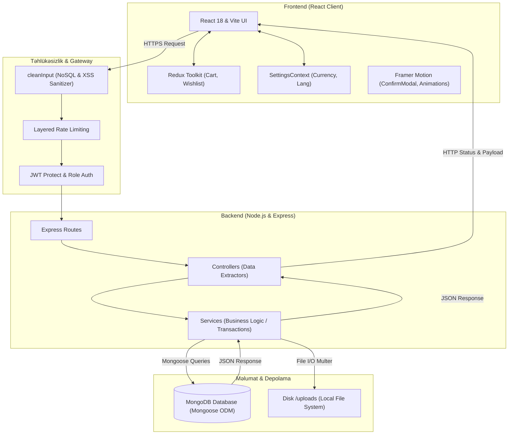

# SoleStyle (Stride) — Texniki Manifest və Master Dokumentasiya 👟🛡️

Bu sənəd **SoleStyle (Stride)** premium e-ticarət platformasının arxitekturasını, proqram təminatının daxili işləmə prinsiplərini, məlumat axınını, təhlükəsizlik zəncirini və həm backend, həm də frontend üzrə bütün kod strukturlarını ən xırda detallarına qədər izah edən rəsmi rəhbərlik sənədidir.

---

## 📌 Mündəricat (Table of Contents)

1. [Ümumi Arxitektura və Texnologiya Steki](#1-ümumi-arxitektura-və-texnologiya-steki)
2. [Layihənin Qovluq Strukturu (Directory Map)](#2-layihənin-qovluq-strukturu-directory-map)
3. [Verilənlər Bazası Arxitekturası (Database Models Deep Dive)](#3-verilənlər-bazası-arxitekturası-database-models-deep-dive)
4. [Backend Biznes Məntiqi və İşləmə Prinsipi (SOA Engine)](#4-backend-biznes-məntiqi-və-işləmə-prinsipi-soa-engine)
5. [Təhlükəsizlik Zənciri və Qorunma Layihələri (Security Framework)](#5-təhlükəsizlik-zənciri-və-qorunma-layihələri-security-framework)
6. [Analitika və Dashboard Hesabat Mühərriki (Aggregation Engine)](#6-analitika-və-dashboard-hesabat-mühərriki-aggregation-engine)
7. [Frontend Arxitekturası və Premium UI/UX Dizayn Sistemi](#7-frontend-arxitekturası-və-premium-uiux-dizayn-sistemi)
8. [Quraşdırma və İstismar Təlimatı (Setup & Execution Guide)](#8-quraşdırma-və-istismar-təlimatı-setup--execution-guide)

---

## 1. Ümumi Arxitektura və Texnologiya Steki

SoleStyle platforması **MERN Stack** (MongoDB, Express, React, Node.js) üzərində, **Xidmət Yönümlü Arxitektura (Service-Oriented Architecture - SOA)** standartlarına tam uyğun olaraq qurulmuşdur. Tətbiq backend biznes məntiqi ilə frontend interfeysini bir-birindən tam ayıran **Decoupled API-Driven** prinsipinə əsaslanır.



### 1.1. İstifadə Olunan Əsas Texnologiyalar və Kitabxanalar:

#### Backend (Server):
*   **Node.js**: Asinxron Event-Driven işləmə mühiti.
*   **Express.js (v5 Safe)**: Web freymvork və sürətli API marşrutlaşdırılması.
*   **MongoDB & Mongoose (ODM)**: Çevik, sənəd yönümlü (Document-Oriented) NoSQL verilənlər bazası və sxem idarəetməsi.
*   **Təhlükəsizlik modulları**: `jsonwebtoken` (JWT), `bcryptjs` (şifrələmə), `express-rate-limit` (sorğu məhdudlaşdırma), `helmet` (HTTP başlıq qoruması), `express-mongo-sanitize` (bazaya inyeksiya qoruması), `hpp` (parametr kirlənməsi qoruması).
*   **Fayl İdarəetməsi**: `multer` (fayl yükləmə idarəçisi) və `fs` (fayl sistemi modulu).

#### Frontend (Müştəri interfeysi):
*   **React 18 (Vite ilə)**: Sürətli SPA (Single Page Application) mühərriki.
*   **TailwindCSS**: Premium vizual üslublar və responsive (uyğunlaşan) dizayn.
*   **Framer Motion**: Saytda canlılıq hissi yaradan zərif, fizika-əsaslı UI keçidləri və animasiyalar.
*   **Redux Toolkit**: Səbət (Cart) və İstəklər Siyahısı (Wishlist) üçün qlobal, performansı yüksək state menecer.
*   **React Context API**: Valyuta məzənnələri, dil və qlobal mağaza sazlamalarını saxlayan `SettingsContext`.
*   **Bildiriş Sistemi**: `react-hot-toast` (zərif mikro-toast pəncərələri).

---

## 2. Layihənin Qovluq Strukturu (Directory Map)

Layihə iki əsas ana qovluğa bölünür: `/server` (arxa fon mühərriki) və `/client` (istifadəçi interfeysi). Hər bir qovluğun daxilindəki modullar ciddi funksional təyinatlarına görə qruplaşdırılmışdır.

### 2.1. Backend (`/server`) Strukturu
```text
/server
├── controllers/          # HTTP sorğularını qəbul edən və cavab qaytaran kontrollerlər
│   ├── admin/            # Admin paneli kontrollerləri (Stats, Products, Orders, Users)
│   ├── misc/             # Qlobal nizamlama kontrollerləri
│   └── user/             # Müştəri kontrollerləri (Auth, Product, Order, Profile)
├── data/                 # İlkin verilənlər bazası toxumları (Seed files)
├── middleware/           # Sorğuların emalı zamanı çalışan təhlükəsizlik və idarəetmə filtrləri
│   ├── user/             # İstifadəçi auth middleware (protect, admin rolları)
│   ├── error.middleware.js # Xətaları tutub mərkəzləşdirilmiş formatda qaytaran middleware
│   ├── security.middleware.js # NoSQL Injection və XSS təmizləyici süzgəclər
│   └── upload.middleware.js # Şəkilləri serverə yükləyən Multer konfiqurasiyası
├── models/               # MongoDB verilənlər bazasının Mongoose sxemləri
│   └── misc/             # Bütün verilənlər modelləri (User, Product, Category, Order, Setting, OTP)
├── routes/               # API marşrutlaşdırma yolları
│   ├── admin/            # Admin əməliyyatları üçün marşrutlar
│   ├── misc/             # Qlobal tənzimləmə marşrutları
│   └── user/             # Müştərilər üçün marşrutlar
├── services/             # Əsas Biznes Məntiqi və Tranzaksiyaların icra edildiyi servis qatı
│   ├── admin/            # Admin əməliyyatları üzrə servislər (Analitika hesablama və s.)
│   └── user/             # Müştəri servisləri (Sifarişlər, Auth servisləri)
├── uploads/              # Məhsul şəkillərinin saxlanıldığı yerli disk qovluğu
├── utils/                # Ortaq istifadə olunan köməkçi modullar (DB bağlantısı, OTP generator)
├── .env                  # Təhlükəsizlik açarları və mühit dəyişənləri
├── server.js             # Proqramın işə düşmə (Entry Point) faylı
└── package.json          # Node.js asılılıqları və script konfiqurasiyaları
```

### 2.2. Frontend (`/client`) Strukturu
```text
/client
├── public/               # Statik fayllar (Loqo, ikonlar)
├── src/
│   ├── assets/           # Şəkillər və ortaq dizayn faylları
│   ├── components/       # Yenidən istifadə edilə bilən React komponentləri
│   │   ├── layout/       # Header, Footer, AdminSidebar kimi əsas çərçivələr
│   │   ├── shared/       # ConfirmModal, ProductCard kimi qlobal komponentlər
│   │   └── widgets/      # Analitika qrafikləri (RevenueChart) və digər widget-lər
│   ├── context/          # Qlobal SettingsContext (Mağaza tənzimləmələri və valyuta)
│   ├── hooks/            # Xüsusi hazırlanmış React hook-ları
│   ├── pages/            # Ekran səhifələri (Home, Shop, Cart, Checkout, Auth, Admin Dashboard)
│   ├── redux/            # Səbət və Wishlist-i idarə edən Redux Toolkit Store
│   ├── routes/           # Frontend marşrutları və Protected Route yolları
│   ├── utils/            # Qiymət və valyuta konversiyaları üçün köməkçi funksiyalar (currencyUtils)
│   ├── App.jsx           # Əsas React komponenti
│   ├── index.css         # CSS dəyişənləri və qlobal üslub qaydaları (Tailwind)
│   └── main.jsx          # React-in DOM-a render olunduğu giriş nöqtəsi
├── vite.config.js        # Vite konfiqurasiya faylı
└── package.json          # Frontend kitabxanaları və asılılıqları
```

---

## 3. Verilənlər Bazası Arxitekturası (Database Models Deep Dive)

Platformanın bütün verilənlər bazası strukturu Mongoose ODM vasitəsilə MongoDB üzərində ciddi şəkildə modelləşdirilmişdir. Aşağıda hər bir modelin quruluşu və təyinatı verilmişdir.

### 3.1. User Model (`misc.user.model.js`)
İstifadəçi profilini, giriş məlumatlarını və müştərinin favorit siyahısını saxlayır.
```javascript
const userSchema = new mongoose.Schema({
  name: { type: String, required: true },
  email: { type: String, required: true, unique: true },
  phone: { type: String, default: '' },
  password: { type: String, required: true },
  role: { type: String, default: 'user' }, // 'user', 'admin', 'principal_admin'
  wishlist: [{ type: String }] // Bəyənilən məhsulların unikal ID (slug) siyahısı
}, { timestamps: true });
```

### 3.2. Product Model (`misc.product.model.js`)
Məhsulların inventar məlumatlarını, endirim faizlərini, kateqoriyasını və ölçülərini tənzimləyir.
```javascript
const productSchema = new mongoose.Schema({
  id: { 
    type: String, 
    unique: true,
    default: () => crypto.randomUUID() // SEO slug yaradılana qədər fallback təminatı
  },
  name: { type: String, required: true },
  category: { type: String, required: true },
  price: { type: Number, required: true }, // USD cinsindən baza qiymət
  originalPrice: { type: Number },
  isOnSale: { type: Boolean, default: false },
  discountPercentage: { type: Number, default: 0 },
  isBestseller: { type: Boolean, default: false },
  isNewItem: { type: Boolean, default: false },
  image: { type: String, default: '' }, // '/uploads/filename.webp'
  description: { type: String, required: true },
  stock: { type: Number, default: 0 },
  sizes: [{ type: Number }] // [38, 39, 40, 41, 42, 43, 44]
});
```

### 3.3. Category Model (`misc.category.model.js`)
Kateqoriyaları və həmin kateqoriyada olan məhsul sayını saxlayır. Bu say **avtomatik sinxronlaşdırılır** ( Trigger-based sync ).
```javascript
const categorySchema = new mongoose.Schema({
  name: { type: String, required: true, unique: true },
  description: { type: String, default: '' },
  count: { type: Number, default: 0 } // Ağır aggregation sorğularının qarşısını alan cache
});
```

### 3.4. Order Model (`misc.order.model.js`)
Müştərinin sifariş məlumatlarını, seçdiyi ölçüləri, qiymətləri və çatdırılma statusunu saxlayır.
```javascript
const orderSchema = new mongoose.Schema({
  user: { type: mongoose.Schema.Types.ObjectId, ref: 'User', required: true },
  items: [{
    product: { type: mongoose.Schema.Types.ObjectId, ref: 'Product', required: true },
    productId: { type: String, required: true }, // SEO Slug ID
    name: { type: String, required: true },
    size: { type: Number, required: true },
    price: { type: Number, required: true },
    quantity: { type: Number, required: true }
  }],
  totalAmount: { type: Number, required: true },
  shippingAddress: {
    address: { type: String, required: true },
    city: { type: String, required: true },
    postalCode: { type: String, required: true },
    country: { type: String, required: true }
  },
  paymentMethod: { type: String, default: 'Cash on Delivery' },
  status: { type: String, default: 'Pending' }, // 'Pending', 'Shipped', 'Delivered', 'Cancelled'
  orderDate: { type: Date, default: Date.now }
});
```

### 3.5. Setting Model (`misc.setting.model.js`)
Bütün e-ticarət tətbiqinin qlobal idarəetmə pultudur. Valyutalar, dərəcələr, promo mətnləri və admin bildirişləri burada saxlanılır.
```javascript
const settingSchema = new mongoose.Schema({
  storeSettings: {
    storeName: { type: String, default: 'Stride' },
    storeEmail: { type: String, default: 'support@stride.com' },
    storePhone: { type: String, default: '+1 (555) 123-4567' },
    currency: { type: String, default: 'USD' },
    exchangeRates: {
      type: Map,
      of: Number, // Qlobal valyutaların USD qarşılığı
      default: { 'USD': 1, 'AZN': 1.70, 'EUR': 0.86, 'TRY': 45.50, 'GBP': 0.74 }
    },
    freeShippingThreshold: { type: Number, default: 75 }, // Pulsuz çatdırılma USD limiti
    taxRate: { type: Number, default: 8.5 }
  },
  appearance: {
    promoBarText: { type: String, default: 'Promo text...' },
    promoBarEnabled: { type: Boolean, default: true }
  },
  notifications: {
    newOrder: { type: Boolean, default: true },
    lowStock: { type: Boolean, default: true },
    orderStatusChange: { type: Boolean, default: true }
  }
}, { timestamps: true });
```

---

## 4. Backend Biznes Məntiqi və İşləmə Prinsipi (SOA Engine)

SoleStyle backend-i **SOA (Service-Oriented Architecture)** sxeminə əsaslandığı üçün kontrollerlər (Controllers) sadəcə HTTP sorğularını idarə edir. Bütün biznes məntiqi servislərdə (Services) cəmlənmişdir.

```text
Sorğu Axını Zənciri:
[HTTP Client] ──> [Routes] ──> [Security/Auth Middleware] ──> [Controller] ──> [Service] ──> [Database / Mongoose]
```

### 4.1. Məhsul yaradılanda SEO Dostu ID Generator
İnventara yeni bir məhsul daxil edilərkən adminin əllə ID yazma ehtiyacı aradan qaldırılmışdır.
1. Admin panelində məhsulun adı (məsələn: `Nike Air Jordan High Retro 2026`) yazıldığı an, frontend-də çalışan generator mətni kiçik hərflərə çevirir, boşluqları tire (`-`) işarəsi ilə əvəzləyir və xüsusi simvolları təmizləyir.
2. Unikal verilənlər bazası toqquşmasının (collision) qarşısını almaq üçün bu mətndən sonra 4 rəqəmli təsadüfi kod əlavə edilir (məs: `nike-air-jordan-high-retro-2026-d3f2`).
3. Bu sahə UI panelində `readOnly` və `cursor-not-allowed` olaraq kilidlənir. Məhsul yaradıldıqdan sonra isə **dəyişdirilməz (immutable)** olaraq qalır. Bu, SEO reytinqinin zərər görməsinin qarşısını alır.

### 4.2. Şəkil Silinməsinin Həyat Dövrü (Storage Image Cleanup Lifecycle)
Platformada verilənlər bazası silindikdə server diskində boş şəkillərin yığılıb qalmaması üçün avtomatik təmizləmə sistemi qurulmuşdur:
*   **Məhsul Silinəndə**: `admin.product.service.js` daxilində məhsul bazadan silinməmişdən öncə onun `image` parametri oxunur. Əgər məhsulun şəkli diskdə mövcuddursa (`fs.existsSync` vasitəsilə), `fs.unlinkSync` metodu dərhal həmin şəkli diskdən silir, ardınca məhsul bazadan təmizlənir.
*   **Məhsul Yenilənəndə**: Əgər admin məhsula yeni şəkil yükləyirsə, serverdəki köhnə şəkil avtomatik olaraq silinir və diskin həcmi boş yerə doldurulmur.

### 4.3. Kateqoriya Saylarının Avtomatik Sinxronlaşdırılması (Trigger-Based Sync)
Kateqoriyalar siyahısı açılarkən serverin hər dəfə minlərlə məhsul arasında aggregation sayım əməliyyatı aparması sistemi yavaşlada bilər. Bunun qarşısını almaq üçün:
*   Məhsul yaradıldıqda, məhsulun aid olduğu kateqoriyanın `count` parametri **1 vahid artırılır** (`$inc: { count: 1 }`).
*   Məhsul silindikdə və ya kateqoriyası dəyişdirildikdə, arxa fonda köhnə kateqoriyanın sayı **1 vahid azaldılır**, yenisinin sayı isə **1 vahid artırılır**.
*   Bu sayədə kateqoriya menyusu **0.001 saniyə** ərzində bazadan birbaşa hazır say məlumatı ilə yüklənir.

---

## 5. Təhlükəsizlik Zənciri və Qorunma Layihələri (Security Framework)

SoleStyle, müasir kiber hücumların qarşısını almaq üçün sənaye standartlarında təhlükəsizlik divarları (waf-style middlewarlar) ilə qorunur.

### 5.1. NoSQL Injection və XSS Qorunması (`cleanInput`)
Hakerlərin MongoDB-yə `$gt`, `$ne` kimi operatorlar daxil edərək verilənləri oğurlamasının və ya `<script>` teqləri vasitəsilə istifadəçilərin brauzerində zərərli kodlar (Cross-Site Scripting) işə salmasının qarşısını almaq üçün qlobal `cleanInput` middleware-i yaradılmışdır.

```javascript
// security.middleware.js
const { sanitize } = require('express-mongo-sanitize');

const safeHtmlEscape = (str) => {
  if (typeof str !== 'string') return str;
  return str.replace(/</g, '&lt;').replace(/>/g, '&gt;');
};

const xssEscape = (obj, parentKey = null) => {
  const skipKeys = ['password', 'email', 'token', 'image', 'images', 'sizes'];
  if (parentKey && skipKeys.includes(parentKey.toLowerCase())) {
    return obj; // Protected sahələrə toxunulmur
  }

  if (typeof obj === 'string') {
    return safeHtmlEscape(obj);
  }
  
  if (Array.isArray(obj)) {
    return obj.map(item => xssEscape(item, parentKey));
  }
  
  if (typeof obj === 'object' && obj !== null) {
    Object.keys(obj).forEach(key => {
      if (skipKeys.includes(key.toLowerCase())) return;
      obj[key] = xssEscape(obj[key], key);
    });
  }
  return obj;
};

exports.cleanInput = (req, res, next) => {
  // 1. MongoDB Operator təmizlənməsi (NoSQL Sanitization)
  if (req.body) sanitize(req.body);
  if (req.query) sanitize(req.query);
  if (req.params) sanitize(req.params);

  // 2. Cross-Site Scripting (XSS) HTML Escape
  if (req.body) xssEscape(req.body);
  if (req.query) xssEscape(req.query);
  if (req.params) xssEscape(req.params);

  next();
};
```

### 5.2. İkiqat Sorğu Məhdudlaşdırma (Layered Rate Limiting)
Sistemi botlardan və DoS/DDoS hücumlarından qorumaq üçün iki fərqli məhdudiyyət tətbiq olunmuşdur:
*   **Qlobal Limit (`limiter`)**: Bütün adi səhifələr və məhsul siyahıları üçün eyni IP-dən **dəqiqədə maksimum 100 sorğu**.
*   **Giriş Limiti (`authLimiter`)**: Giriş, qeydiyyat və OTP doğrulaması marşrutları üçün brute-force hücumlarının qarşısını almaq məqsədilə **dəqiqədə maksimum 20 sorğu**.
*   **Admin İstisnası**: Adminlərin idarəetmə panelində sürətli işləyə bilməsi üçün, administrator sorğuları bu limitlərdən azaddır.

### 5.3. Əsas Admin və Özünü Silmə Kilidi (Security Lock)
Sistemin tamamilə adminsiz qalmasının və daxili münaqişələrin qarşısını almaq üçün ikiqat backend qorunma tədbiri tətbiq olunmuşdur:
1.  **Principal Admin Qoruması**: `admin@solestyle.com` və ya `role === 'principal_admin'` olan əsas administrator nə frontend interfeysindən, nə də birbaşa Postman/API sorğuları vasitəsilə **silinə bilməz** və onun rolu **dəyişdirilə bilməz**. Servis qatında bu cəhd dərhal bloklanır və `400 Bad Request` qaytarılır.
2.  **Özünü Silmə Qadağası**: Aktiv daxil olmuş heç bir inzibatçı öz cari hesabını sistemdən silə bilməz (`req.params.id !== req.user._id`).

---

## 6. Analitika və Dashboard Hesabat Mühərriki (Aggregation Engine)

SoleStyle Admin Dashboard panelindəki analitik məlumatlar heç bir demo və ya simulyasiyaya əsaslanmır. Qrafiklər və hesabatlar **canlı verilənlər bazası aqreqasiyası (MongoDB Aggregation Pipeline)** vasitəsilə hesablanır.

### 6.1. Həftəlik Satış və Gəlir Aqreqasiyası (`admin.stats.service.js`)
Dashboard-dakı `RevenueChart` üçün son 7 günün gəlir hesabatı bazadan aşağıdakı optimal pipeline sorğusu ilə toplanır:

```javascript
const salesHistory = await Order.aggregate([
  { 
    // 1. Son 7 günün sifarişlərini filtrlə və ləğv edilmişləri kənara at
    $match: { 
      orderDate: { $gte: sevenDaysAgo }, 
      status: { $ne: 'Cancelled' } 
    } 
  },
  {
    // 2. Günlərə görə qruplaşdır və cəmi məbləği topla
    $group: {
      _id: { $dateToString: { format: "%Y-%m-%d", date: "$orderDate" } },
      total: { $sum: "$totalAmount" },
      count: { $sum: 1 }
    }
  },
  { 
    // 3. Tarix ardıcıllığı ilə sırala
    $sort: { "_id": 1 } 
  }
]);
```

### 6.2. Faiz Dəyişikliyi Hesablama Düsturu (`calcChange`)
Sistem cari həftə ilə ötən həftənin statistikasını (Gəlir, Yeni İstifadəçilər, Gözləyən Sifarişlər) müqayisə edərək faiz dəyişikliyini avtomatik hesablayır:

$$\text{Dəyişiklik (\%)} = \frac{\text{Cari Həftə} - \text{Ötən Həftə}}{\text{Ötən Həftə}} \times 100$$

Əgər ötən həftə heç bir satış olmayıbsa və cari həftə ilk satış reallaşıbsa, sıfıra bölünmə xətasının qarşısını almaq üçün arxa fonda riyazi mühafizə məntiqi (`calcChange`) çalışır və faizi avtomatik olaraq `+100%` olaraq göstərir.

---

## 7. Frontend Arxitekturası və Premium UI/UX Dizayn Sistemi

SoleStyle frontend-i istifadəçiyə premium brend (Apple, Nike, Balenciaga üslubunda) hissi bağışlayacaq şəkildə vizual olaraq optimallaşdırılmışdır.

### 7.1. SettingsContext və Çox-Valyutalı Məzənnə Mühərriki
Bütün tətbiqdə qiymətlər arxa fonda verilənlər bazasında **USD ($)** olaraq saxlanılır. Lakin istifadəçi saytın dil və valyuta tənzimləmələrini dəyişdikdə:
1. `SettingsContext` serverdən real vaxtda adminin təyin etdiyi `exchangeRates` xəritəsini (Map) yükləyir.
2. `currencyUtils.js` vasitəsilə bütün məhsulların qiyməti, səbət cəmi, vergilər və hətta **"Pulsuz Çatdırılma Limiti"** seçilmiş valyutaya (AZN, EUR, TRY, GBP və s.) dərhal konvertasiya olunur.
3. **Düstur**: $$\text{Qiymət (Valyuta)} = \text{Baza Qiyməti (USD)} \times \text{Məzənnə}$$

### 7.2. Qlobal Premium ConfirmModal Sistemi (SweetAlert-in Əvəzlənməsi)
Köhnə görünüşlü default SweetAlert pop-up pəncərələri tətbiqdən tamamilə silinmişdir. Yerində Framer Motion və TailwindCSS əsasında hazırlanmış qlobal **`ConfirmModal`** komponenti tətbiq edilmişdir:
*   **Dizayn (Glassmorphism)**: Tünd mövzulu, arxa fonu bulurlaşdırılmış (backdrop-blur-md), zərif haşiyəli şüşə effekti.
*   **Animasiya**: Modal açılarkən yüngül bounce (spring) effekti ilə böyüyür, bağlanarkən isə zərifcə sönür.
*   **Hot-Toast Bildirişləri**: Uğurlu əməliyyatlarda böyük pəncərə çıxıb istifadəçini yormaması üçün ekranın küncündən çıxan sürətli `react-hot-toast` bildirişlərindən istifadə olunur.

### 7.3. Cross-Browser Custom Scrollbar
Bütün cədvəllər (Products, Orders, Users) və mətn sahələrində brauzerin standart kobud skrolbarları ləğv edilmişdir. Chromium (Chrome, Edge, Opera) brauzerləri üçün `::-webkit-scrollbar` və Firefox üçün qlobal `scrollbar-width: thin` CSS standartları tətbiq edilərək, incə, tünd rəngli premium skrolbarlar inteqrasiya edilmişdir.

---

## 8. Quraşdırma və İstismar Təlimatı (Setup & Execution Guide)

Layihəni lokal və ya xarici serverdə quraşdırmaq üçün aşağıdakı addımları izləyin:

### 8.1. Ətraf Mühit Dəyişənləri (Environment Variables)

#### Backend üçün (`/server/.env`):
```env
PORT=5000
MONGO_URI=mongodb+856_your_mongodb_connection_string
JWT_SECRET=your_super_secret_jwt_key_2026
FRONTEND_URL=http://localhost:5173
```

#### Frontend üçün (`/client/.env`):
```env
VITE_API_BASE_URL=http://localhost:5000
```

### 8.2. Addım-addım Quraşdırma Əmrləri

#### 1. Backend-in işə salınması:
```bash
cd server
npm install
npm run dev
```

#### 2. Frontend-in işə salınması:
```bash
cd client
npm install
npm run dev
```

> [!TIP]
> **Canlı İstehsalat (Production) Rejimi üçün:**
> Frontend tərəfində kodu optimallaşdırıb sıxmaq üçün `npm run build` əmrini icra edin. Yaranan `dist` qovluğunu Nginx və ya statik hostinq xidmətində yerləşdirə bilərsiniz.

---

> [!IMPORTANT]
> SoleStyle (Stride) platformasının təhlükəsizlik və arxitektura prinsiplərinə uyğun olaraq, backend daxilində ediləcək hər hansı bir funksional dəyişiklik mütləq şəkildə **Servis Qatında (Services)** aparılmalıdır. Kontrollerlər yalnız məlumatları ötürməklə mükəlləfdir.

---
*Sənəd son dəfə yenilənib: 20-May-2026*
