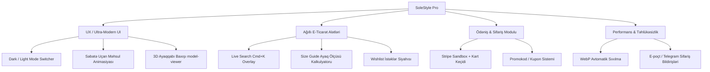

# SoleStyle (Stride) — Premium Yol Xəritəsi (Future Roadmap) 🚀

Bu sənəd **SoleStyle** platformasını standart e-ticaret saytından, qabaqcıl brendlərin (Nike, Adidas, Balenciaga) səviyyəsində, **premium və ultra-modern** bir e-ticarət təcrübəsinə çevirmək üçün tətbiq edilə biləcək ən effektiv funksiyaları və vizual təkmilləşdirmələri özündə birləşdirir.

---

## 📅 Yol Xəritəsi & Premium Təkliflər

---

## 1. 🎨 Vizual Estetika və Premium UX (Rich Aesthetics)

### 🌓 1.1. Tam Həqiqi Tünd / İşıqlı Mövzu Keçidi (Dark/Light Theme Switcher)
Hazırda saytın dizaynı əsasən tünd (dark-mode) rəng tonları (`bg-gray-950`, `text-white`) üzərində qurulub.
*   **Təklif**: CSS Variables və ya Tailwind-in `dark:` klassları vasitəsilə təmiz, minimalist və premium **İşıqlı Mövzu** (Light Mode) əlavə etmək.
*   **İstifadəçi Təcrübəsi**: Naviqasiya panelində zərif ay/günəş animasiyalı düymə (Framer Motion ilə spin effekti).

### 👟 1.2. 3D Model Baxışı (Interactive 3D Preview)
Sneaker (idman ayaqqabısı) mədəniyyətində məhsulun hər tərəfinə baxmaq alıcıları cəlb edən ən vacib amillərdən biridir.
*   **Təklif**: Google-un `<model-viewer>` kitabxanasını və ya Three.js əsaslı sadə bir React komponentini Product Detail səhifəsinə inteqrasiya etmək.
*   **Effekt**: İstifadəçi ayaqqabını 360 dərəcə fırlada, böyüdüb-kiçildə və materialın toxumasına canlı baxa bilər. Məhsul səhifəsində `.glb` formatlı 3D faylı yükləmək üçün admin panelə sahə əlavə edilə bilər.

### 🛒 1.3. "Səbətə Uçma" Animasiyası (Fly-to-Cart Micro-interaction)
Məhsulu səbətə əlavə edərkən sadəcə toast çıxması əvəzinə gözoxşayan bir mikro-animasiya.
*   **Təklif**: "Add to Cart" düyməsinə kliklədikdə məhsulun kiçik şəklinin (thumbnail) vizual olaraq ekran üzərindən süzərək yuxarıdakı Səbət ikonuna doğru "uçması" və səbət ikonunun zərifcə böyüyüb-kiçilməsi (spring/bounce animasiyası).

---

## 2. 🧠 Ağıllı E-Ticarət Alətləri (Smart E-Commerce Features)

### 🔍 2.1. Qabaqcıl Canlı Axtarış & Köməkçi Panel (Live Search & Autocomplete Overlay)
Mövcud axtarış sistemini daha interaktiv etmək.
*   **Təklif**: Həm axtarış barına kliklədikdə, həm də klaviaturada `Ctrl + K` (və ya `Cmd + K`) basıldıqda ekranı örtən şüşəvari (blur) gözəl bir axtarış pəncərəsinin açılması.
*   **Məntiq**: İstifadəçi yazmağa başladığı an arxa fonda məhsul şəkilləri, qiymətləri və kateqoriyaları ilə birlikdə canlı nəticələrin siyahılanması.

### 📏 2.2. Ağıllı Ölçü Kalkulyatoru (Fit Finder / Size Guide Modal)
Brenddən brendə (məsələn, Nike ilə Adidas arasında) ayaqqabı ölçüləri fərqlənə bilir.
*   **Təklif**: "Ölçünü tap" (Find my size) düyməsi. Açılan modalda istifadəçi ayağının santimetr (CM) ilə ölçüsünü və ya geyindiyi hər hansı başqa brendin ölçüsünü daxil edir, sistem isə ona bu məhsul üçün ən ideal ölçünü (məs: US 9.5) məsləhət görür.

### ❤️ 2.3. "Wishlist" — İstəklər Siyahısı
İstifadəçilərin bəyəndiyi məhsulları yadda saxlayıb sonradan alması üçün.
*   **Təklif**: Redux və ya LocalStorage ilə çalışan, məhsul kartlarında zərif ürək ikonu ilə aktivləşən "İstəklərim" səhifəsi.

---

## 3. 💳 Ödəniş və Satış Mühərriki (Checkout & Monetization)

### 💳 3.1. Stripe / Apple Pay Sandbox Simulyasiyası
Saytın real ödəniş qəbul edə bildiyini göstərmək üçün interaktiv ödəniş mərhələsi.
*   **Təklif**: Checkout səhifəsinə Stripe Elements üslubunda, daxil edilən kartın tipini (Visa, Mastercard) vizual olaraq təyin edən və kart nömrəsini yazdıqca animasiya ilə dönən premium 3D Kart dizaynı əlavə etmək.
*   **Uğurlu Ödəniş**: Ödəniş tamamlandıqda ekrandan konfeti (confetti) tökülən premium "Təşəkkür edirik" ekranı.

### 🎟️ 3.2. Promokod / Kupon Sistemi
*   **Təklif**: Səbət və checkout səhifəsində kupon sahəsi. Admin panelindən yaradılan faizli (məs: `SOLE20` - 20% endirim) və ya birbaşa məbləğli (məs: `WELCOME10` - 10$ endirim) kodların bazada yoxlanaraq cəmi məbləğə dərhal tətbiq olunması.

---

## 4. ⚡ Sistem Performansı və İdarəetmə (Backend & Infra)

### 🖼️ 4.1. Şəkillərin Avtomatik WebP Sıxılması (Image Processing Pipeline)
Ayaqqabı şəkillərinin keyfiyyətli olması vacibdir, lakin böyük həcmli şəkillər saytı yavaşladır.
*   **Təklif**: Backend-də şəkil yüklənən hissəyə `sharp` kitabxanasını əlavə etmək.
*   **Məntiq**: İstifadəçi və ya admin hansı formatda (PNG, JPG) şəkil yükləyirsə yükləsin, server onu avtomatik olaraq **WebP** formatına çevirir, sıxır və optimal ölçülərdə saxlayır. Bu, saytın yüklənmə sürətini 3-4 dəfə artıracaq.

### 🔔 4.2. Telegram / E-poçt İnteqrasiyası ilə Sifariş Bildirişləri
*   **Təklif**: Yeni sifariş gəldikdə adminə dərhal Telegram Botu vasitəsilə bildiriş getməsi:
    > "🎉 **Yeni Sifariş!** \n👤 Müştəri: Elvin \n💰 Məbləğ: 175.00 AZN \n📦 Məhsul: Nike Air Max x8z2"
*   **Müştəri üçün**: Sifariş tamamlandıqda nodemailer vasitəsilə müştəriyə vizual olaraq gözəl dizayn edilmiş HTML faktura e-poçtunun göndərilməsi.

---

